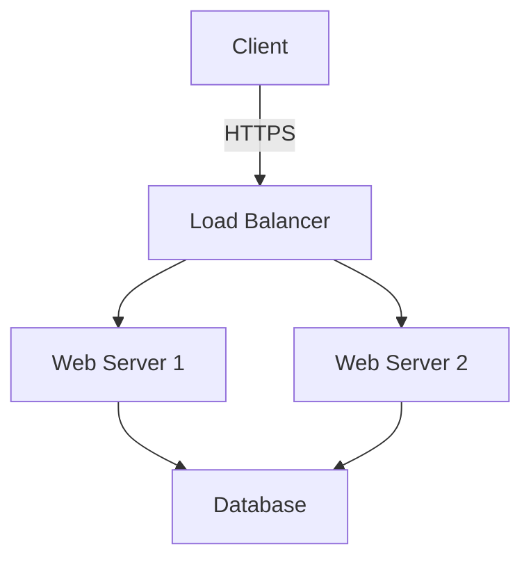
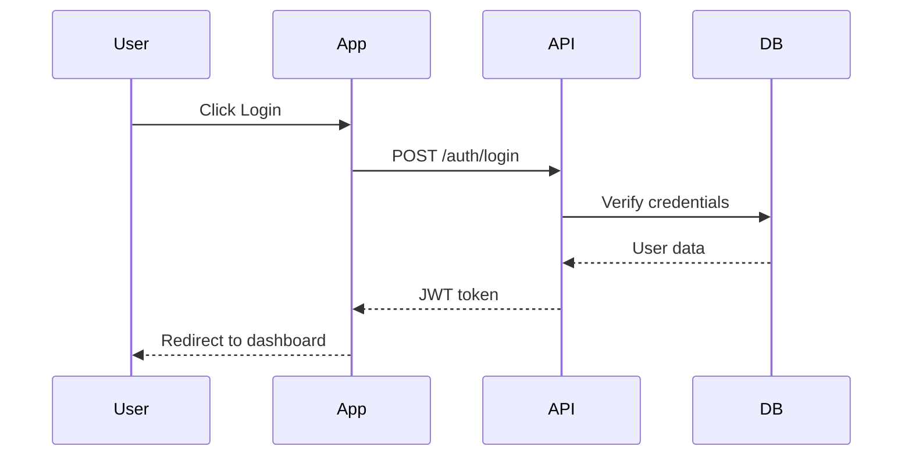
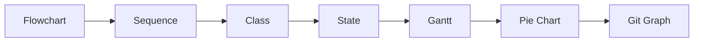
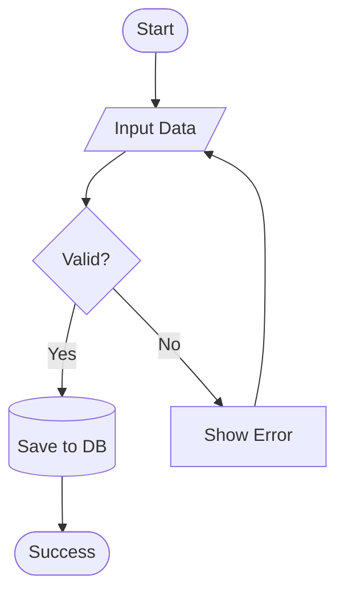
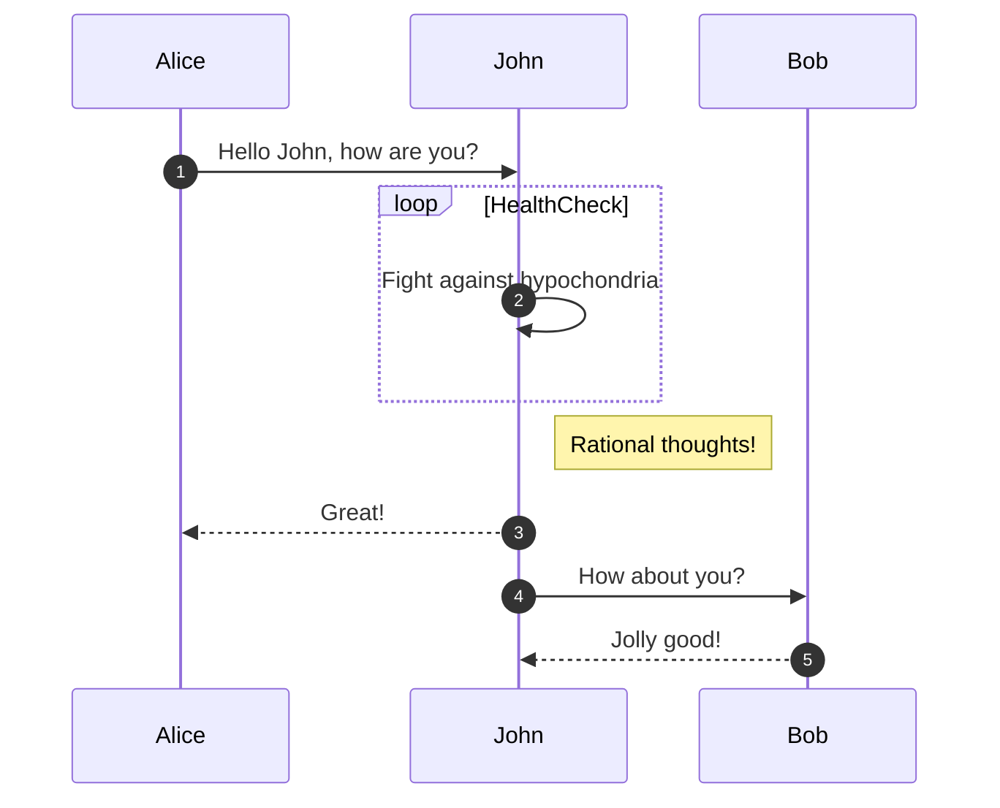
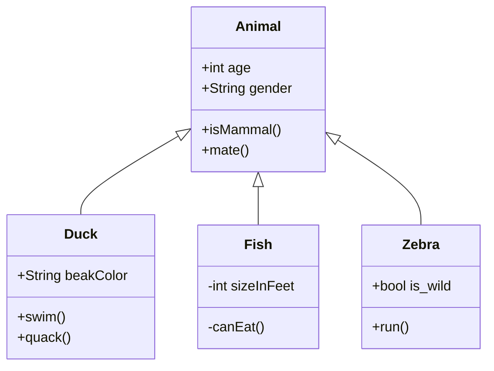
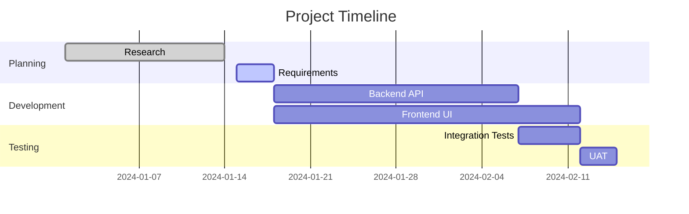

# Mermaid Plugin

Official Chiron plugin for rendering Mermaid diagrams in documentation pages.

## Features

- ✅ **Automatic Detection** - Detects ````mermaid` code blocks automatically
- ✅ **Lazy Loading** - Mermaid.js loads only on pages with diagrams
- ✅ **CDN Optimized** - Uses Chiron's external scripts system
- ✅ **Theme Support** - Default, dark, forest, neutral themes
- ✅ **All Diagram Types** - Flowcharts, sequence, gantt, class, state, and more
- ✅ **Zero Configuration** - Works out of the box

## Installation

This plugin is **built-in** with Chiron. No npm install needed!

## Usage

### Enable the Plugin

Add to `plugins.yaml`:

```yaml
plugins:
  - name: "mermaid"
    enabled: true
```

### Create Diagrams

In your Markdown files, use ````mermaid` code blocks:

````markdown
# My Documentation

## System Architecture



## User Flow


````

### Supported Diagram Types



See [Mermaid Documentation](https://mermaid.js.org/) for all diagram types.

## Configuration

### Basic Configuration

```yaml
plugins:
  - name: "mermaid"
    enabled: true
    config:
      theme: "default"  # or "dark", "forest", "neutral"
```

### Advanced Configuration

```yaml
plugins:
  - name: "mermaid"
    enabled: true
    config:
      theme: "dark"
      cdn: "https://cdn.jsdelivr.net/npm/mermaid@10/dist/mermaid.esm.min.mjs"
      loadOnDemand: true    # Only load on pages with diagrams (recommended)
      initOnLoad: true      # Auto-initialize Mermaid
      logLevel: "error"     # Mermaid console logs: error, warn, info, debug
```

### Configuration Options

| Option | Type | Default | Description |
|--------|------|---------|-------------|
| `theme` | string | `"default"` | Mermaid theme: `default`, `dark`, `forest`, `neutral` |
| `cdn` | string | jsDelivr CDN | Custom Mermaid.js URL |
| `loadOnDemand` | boolean | `true` | Load script only on pages with diagrams |
| `initOnLoad` | boolean | `true` | Auto-initialize Mermaid on page load |
| `logLevel` | string | `"error"` | Console log level |

## Examples

### Flowchart



### Sequence Diagram



### Class Diagram



### Gantt Chart



## Shortcode Usage (Alternative)

You can also use the `:::mermaid` shortcode:

```markdown
:::mermaid
graph LR
    A --> B
    B --> C
:::
```

## How It Works

1. **Detection**: Plugin scans Markdown for ````mermaid` blocks
2. **Registration**: If found, registers Mermaid.js via external scripts system
3. **Lazy Loading**: Script loads only on pages with diagrams (performance!)
4. **Initialization**: Auto-configures Mermaid with your theme
5. **Rendering**: Mermaid.js renders diagrams on page load

## Performance

- ⚡ **Lazy Loading**: ~50KB library loads only when needed
- ⚡ **CDN Cached**: Mermaid.js served from fast CDN
- ⚡ **Zero Runtime**: Diagrams render client-side (no server processing)
- ⚡ **Deduplication**: Script loaded once even with multiple diagrams

## Troubleshooting

### Diagrams not rendering

**Check browser console** for Mermaid errors:

```javascript
// Should see:
Mermaid initialized: {version: "10.x.x", ...}
```

**Verify code block syntax**:
- Must use ````mermaid` (lowercase)
- Must be valid Mermaid syntax

### Theme not applying

Check `plugins.yaml` configuration:

```yaml
config:
  theme: "dark"  # Must be valid Mermaid theme
```

Rebuild site:

```bash
npm run build
```

### Custom CDN not loading

Ensure CDN URL is whitelisted in Chiron's external scripts validator.

## Advanced: Custom Initialization

For advanced Mermaid configuration, you can override initialization in `custom.js`:

```javascript
// custom-templates/custom.js
import mermaid from 'https://cdn.jsdelivr.net/npm/mermaid@10/dist/mermaid.esm.min.mjs';

mermaid.initialize({
  startOnLoad: true,
  theme: 'dark',
  themeVariables: {
    primaryColor: '#8b5cf6',
    primaryTextColor: '#fff',
    primaryBorderColor: '#7c3aed',
    lineColor: '#a78bfa',
    secondaryColor: '#c4b5fd',
    tertiaryColor: '#ddd6fe'
  },
  flowchart: {
    curve: 'basis',
    padding: 20
  }
});
```

## Related Documentation

- [Mermaid.js Official Docs](https://mermaid.js.org/)
- [Chiron External Scripts](../../EXTERNAL-SCRIPTS.md)
- [Chiron Plugin System](../../PLUGINS.md)
- [Creating Custom Plugins](../../CREATING-PLUGINS.md)

## License

MPL-2.0 - Part of Chiron Static Site Generator

---

**Chiron Mermaid Plugin v1.0.0** • Built-in plugin by AGILira
